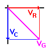

## Theory 

  

 

  When we apply an AC voltage to a resistor and capacitor in series, as shown in the schematic diagram below, the capacitor will constantly charge and discharge as the input voltage is constantly changing.

  Essentially, R and C in this circuit now form a voltage divider for AC. We can expect that part of the applied voltage will appear across R, and part will appear across C. But how much voltage will appear across each component?

  As a practical example of such a circuit, assume <code>VAC = 10 V_{rms}</code> at a frequency of 1 Hz ( $f=1\text{Hz}$). <code>C = 0.01 F</code> and <code>R = 5 &Omega;</code>. If we were to build this circuit with an accurate audio frequency generator, we would measure a voltage of 3 Vrms across the resistor, and 9.54 Vrms across the capacitor. This of course adds up to considerably more than the 10 Vrms supplied by the generator. How is this possible?

  The question is compounded by the fact that <code>C</code> will cause a phase shift between voltage and current. Since this is a series circuit, the current must necessarily be the same everywhere in the circuit. Therefore the voltage across the capacitor will lag that current by 90&deg;, while at the same time the voltage across the resistor will be in phase with the current. How can we deal with such a mess?

  The real problem here is the 90&deg; phase shift between <code>VC</code> and <code>VR</code>. Since they are not in phase and some voltage is dropped across each component, the phase relationship between generator voltage and generator current must be somewhere between the two extremes. We need to be able to determine that relationship, as well as to determine the combined effect of R and <code>XC</code> in this circuit.

  One solution is to map the component voltages graphically, as shown to the right. Using X-Y coordinate axes, the positive X axis is defined as the zero-degree reference, and counter-clockwise rotation is defined as the direction of increasing positive angles.

  Since the circuit current is necessarily the same throughout the circuit, it is used as the reference phase angle. Resistive voltage, <code>VR</code>, is in phase with the current as shown in red. Capacitive voltage, <code>VC</code>, is at -90&deg; as shown in blue. In this way, we can represent the voltages across R and C as vectors, having direction as well as magnitude. Now it is clear that the composite voltage comprising both <code>VR</code> and <code>VC</code> must be the vector sum of the two, as shown in violet.

  To find the composite voltage, we must apply the formula for the diagonal of a rectangle, and find the square root of the sum of the squares:

  Another point to consider here is that this circuit contains both resistance (R) and reactance (<code>XC</code>). This is neither a pure resistance nor a pure reactance. We need a name for this combined characteristic and a means of calculating it.

  The name is easy enough; the combined characteristic is named <em>impedance</em>, and is represented by the letter <code>Z</code>. To calculate <code>Z</code>, we must first note that, in accordance with Ohm's Law, <code>R = VR/I</code> and <code>XC = VC/I</code>. But we already know that the voltages are 90&deg; out of phase. Since the circuit current, <code>i</code>, is the same everywhere, then <code>R</code> and <code>XC</code> must be 90&deg; out of phase as well. Thus, we must apply the same method for finding <code>Z</code> as we did for finding the composite voltage. The full set of calculations for this circuit then, using the circuit values given above is:

$$X_c = \frac{1}{2\pi fC}= \frac{1}{6.28 \times 1 \times 0.01}$$
$$= \frac{1}{6.28 \times 10^{-2}}= 15.92\mathrm{\Omega}$$

$$Z = (R^2 + X_c^2)^{1/2}= (5^2 + 15.92^2)^{1/2}$$
$$= (25 + 253.45)^{1/2}= 278.45^{1/2}= 16.69\mathrm{\Omega}$$

$$I = \frac{V_G}{Z}= \frac{10\mathrm{V}}{16.69\mathrm{\Omega}}= 0.6\mathrm{A}$$
$$V_R = I \times R= 0.6\mathrm{A} \times 5\mathrm{\Omega}= 3\mathrm{V}$$

$$V_C = I \times X_C= 0.6\mathrm{A} \times 15.92\mathrm{\Omega}=9.54 \text{V}$$

The actual phase angle between generator current and generator voltage is (with voltage lagging current):

$$= \arctan\left(\frac{X_C}{R}\right) = \arctan\left(\frac{15.92}{5}\right) = \arctan\left(3.184\right) = 72.56^\circ$$

  Thus, all circuit values and calculations remain consistent with each other and with actual measurements made on experimental circuits.

  This can be easily verified using the simulator, by creating the above-mentioned circuit and measuring the current and voltages across the resistor and capacitor.

## Applications
Variable tuned circuits
1. Integrator
2. Differentiator
3. Filters
4. Used as Pulse discharge circui

